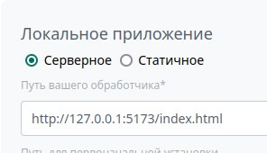

# bitrix24-create-app

Интерфейс командной строки для установки шаблонов приложений

### Шаблоны

* [vue-template](https://github.com/astrotrain55/bitrix24-create-app/tree/master/templates/vue-template#readme) (Vue 3, Pinia, Vite, [vue-bitrix24](https://www.npmjs.com/package/vue-bitrix24))

### Использование

```sh
npx bitrix24-create-app@latest
# или
npx bitrix24-create-app@latest --template=vue-template --name=testproject
```
```sh
git init
```

### Подключение к Битрикс24

* Создайте локальное приложение на существующем портале по ссылке https://DOMAIN.bitrix24.ru/devops/section/standard/
  * Или создайте новый портал https://www.bitrix24.ru/create.php (для регистрации лучше использовать временную почту, например https://temp-mail.org/ru/)
* "Путь вашего обработчика":
  * `http://127.0.0.1:5173/index.html` для локальной разработки (`npm run dev`)
  * `ПУТЬ_ДО_ПРИЛОЖЕНИЯ_НА_СЕРВЕРЕ/dist/index.html` для стандартной разработки (`npm run watch`)
* Список установленных приложений можно посмотреть тут https://DOMAIN.bitrix24.ru/devops/list/

___

Based on [@pongsatt/mycli](https://github.com/pongsatt/mycli)
